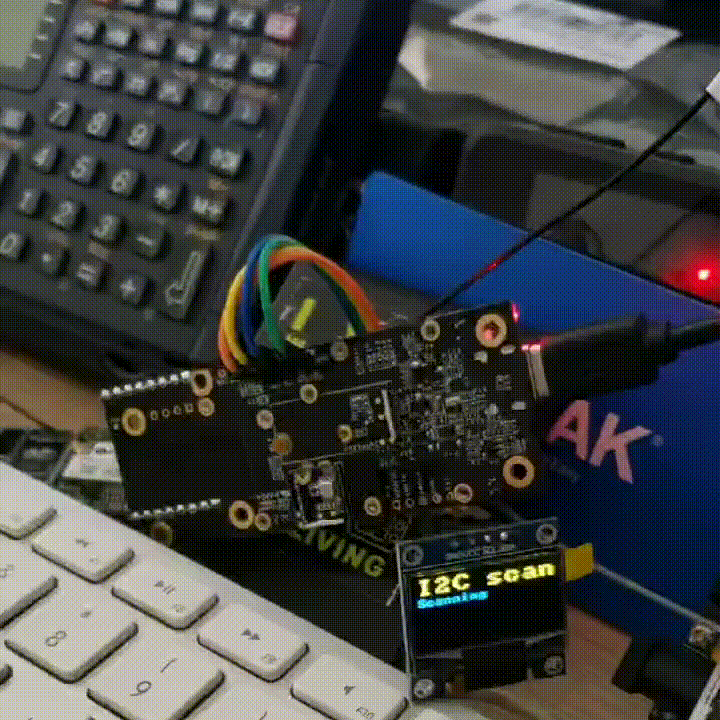

# RAK4631_I2C_Scanner

An I2C scanner for the RUI3 platform. It detects the presence of an OLED and displays results both on Serial and OLED (if available).

To make the [ss_oled](https://github.com/bitbank2/ss_oled) library work with RUI3 for the moment (we're missing stuff from `avr/pgmspace`), you need to patch `ss_oled.h`:

Right below `#include <BitBang_I2C.h>` insert:

```c
#ifdef __RUI_TOP_H__
#include "/Users/XXXXXXXX/Library/Arduino15/packages/rakwireless/hardware/nrf52/1.0.1/cores/nRF5/avr/pgmspace.h"
#endif
```

Where `XXXXXXXX` is your user ID. This works for Mac. For Linux and Windows the paths will be slightly different, but should be easily fixable.



